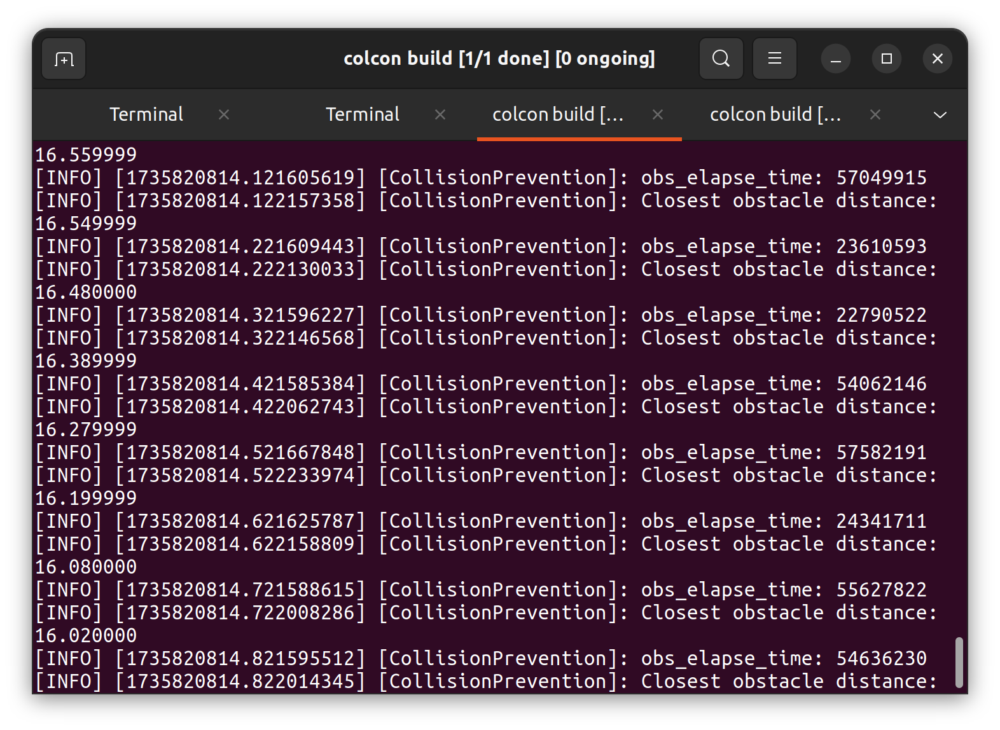
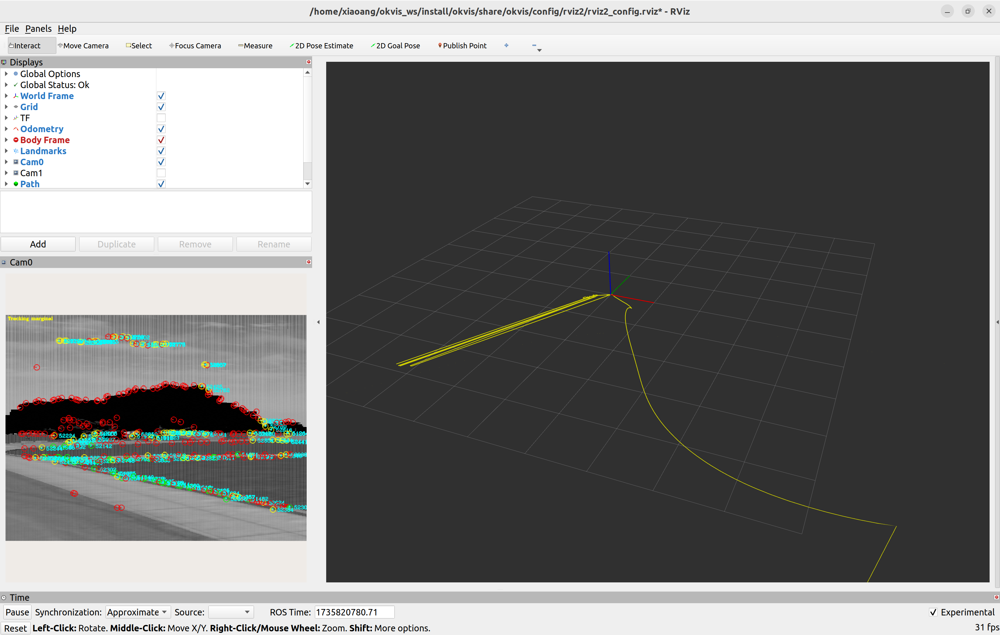

# Drone Exploration and Collision Prevention Demo

This page demonstrates the random exploration and collision prevention strategies for effective autonomous navigation and mapping.

---

## Random Exploration Demo

The drone employs three types of random exploration policies for exploration new environment:

1. **Forward/Backward Movement:**  
   The drone moves forward or backward, aligned with its current yaw angle, with a velocity magnitude uniformly sampled between **0.5 m/s** and **1.5 m/s**.

2. **Position Locked Mode:**  
   While maintaining a fixed position, the drone rotates within a yaw range of **±37.5°** to scan its surroundings.

3. **Horizontal Movement:**  
   The drone moves horizontally in a random direction with a randomly sampled velocity magnitude.

---

## Collision Prevention Demo

Two types of **Collision Prevention** policies are implemented to handle concave and non-concave spaces efficiently for mapping and exploration:

1. **Concave Space Handling:**  
   - The drone performs a **180° turn**, aligning its camera's yaw angle with the new velocity direction to escape the concave area.

   

2. **Non-Concave Space Handling:**  
   - The drone's velocity vector is adjusted to be **perpendicular to the direction pointing from vehicle to the closest obstacle**.  
   - In cases where the drone is flying towards a wall, the velocity will be adjusted to run **parallel to the wall**, allowing smooth navigation along the obstacle.
   - The camera's yaw angle is aligned opposite to the direction of the closest obstacle, enhancing environmental awareness.

   

3. **Real-Time Performance**

   The collision prevention module exhibits high computational efficiency, making it well-suited for real-time applications.

   - **Fast Obstacle Map Updates**: The module efficiently updates the obstacle map at a high frequency, as demonstrated in the *Elapse Time Demo* (see figure below).  
   

   - **Low Latency in Setpoint Calculations**: New setpoints are computed in under 1 ms, ensuring rapid responses to changes in the environment. This is illustrated in the *Non-Concave Space Demo*.

## NoMaD Demo

[NoMaD: Goal Masked Diffusion Policies for Navigation and Exploration](https://arxiv.org/pdf/2310.07896) has been successfully integrated into the current codebase. It can identify road paths, and modify the vehicle yaw angle to align with with road direction. 

However, in certain situations, it selects paths (e.g., the yellow path shown in the demo video) that result in collisions. [Demo Video](https://drive.google.com/file/d/1Ra0ymba2Z3xgwwJOoG6dh5PbuQMNfDAU/view?usp=sharing)

**Potential Quick Solutions:**
1. Fine-tune the NoMaD model with goal-directed navigation for learning collision-free paths in baylands since NoMaD employs the unified diffusion policy model for both navigation and exploration.
2. Change the policy of our collision prevention module, so that 
   the drone always flies away from the obstacle regardless the concavity of the obstacle it faces.
---

## Okvis2 (Visual-Inertial SLAM) Demo

[Okvis2](https://github.com/smartroboticslab/okvis2) is a real-time, scalable Visual-Inertial Simultaneous Localization and Mapping (VI-SLAM) system that effectively addresses challenges associated with long and repeated loop closures.

Okvis2 has been successfully deployed in Gazebo Sim.  

